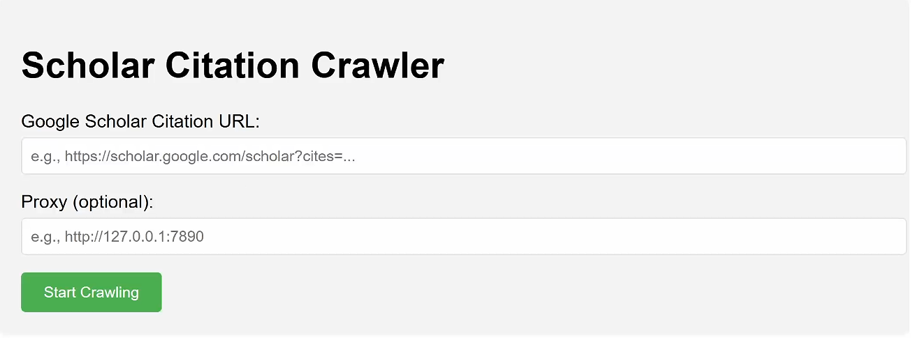

# scholar_crawler
A web-based tool to crawl citation data from Google Scholar and export it as a CSV file. Built with Flask (backend) and a simple HTML/CSS frontend, this project allows users to input a Google Scholar citation URL, scrape the citing papers, and download the results.




## Installation
1. Clone the Repository
```bash
git clone https://github.com/Yuqin-G/scholar_crawler.git
```
2. Install Dependencies
```bash
cd scholar_crawler
pip install -r requirements.txt
```

## Usage
1. Run the Application
   ```bash
   python app.py
2. Access the Web Interface
* Open your browser and navigate to http://127.0.0.1:5000.
3. Scrape Citations
* Enter a Google Scholar citation URL.
* (Optional) Provide a proxy address (e.g., http://127.0.0.1:7890) if needed.
* Click "Start Crawling" to begin scraping.
4. View and Download Results
* See the original paper title, total citation count, and a preview of the first 5 citations.
Click the "Download" link to get the full CSV file, saved as cite_[OriginalTitle].csv in the static/ directory.
